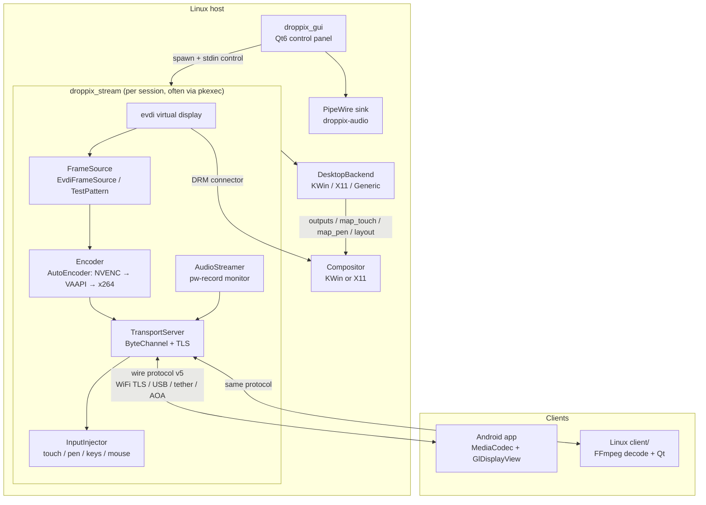
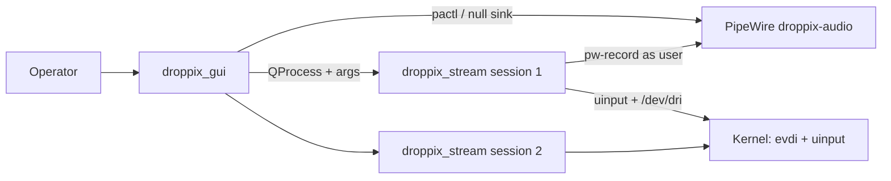
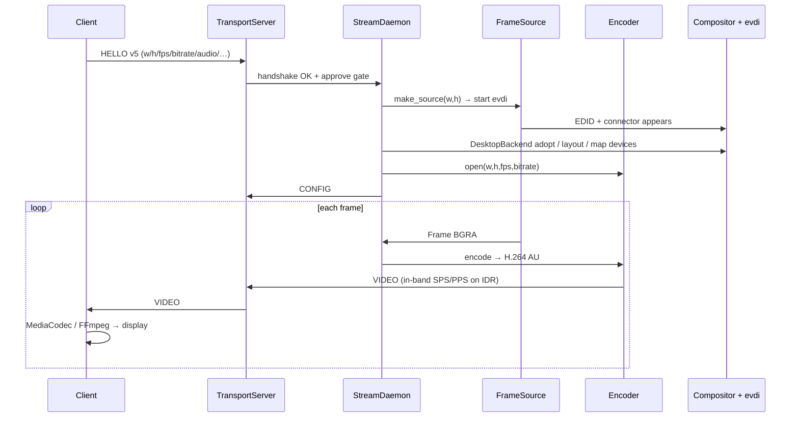
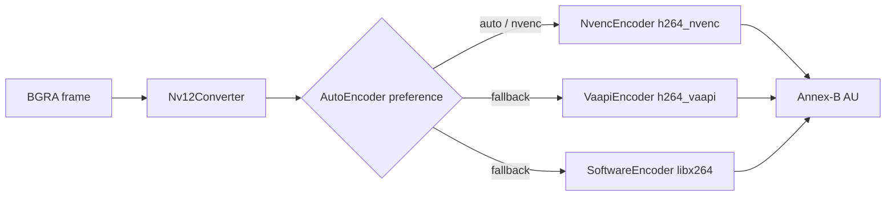
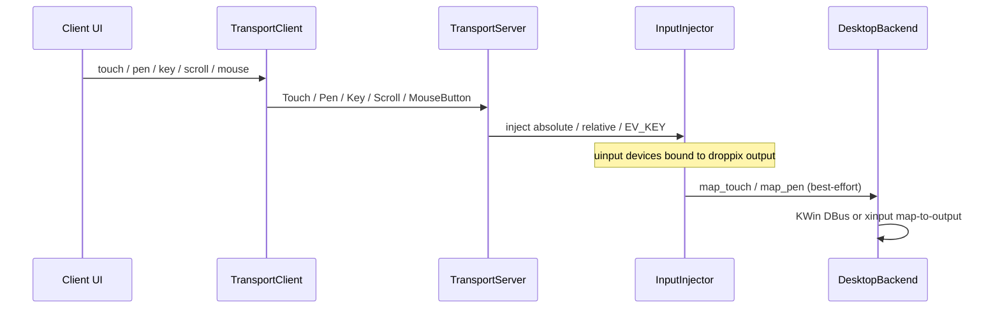
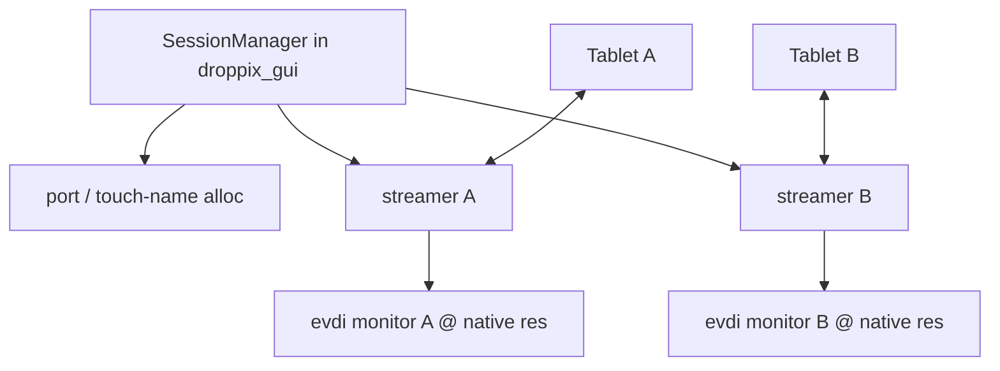
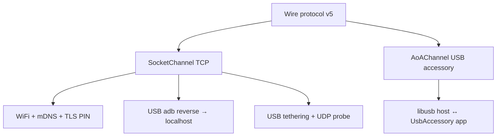
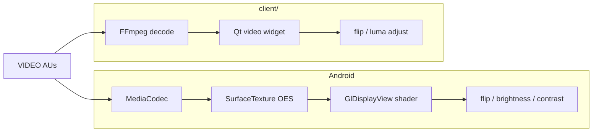
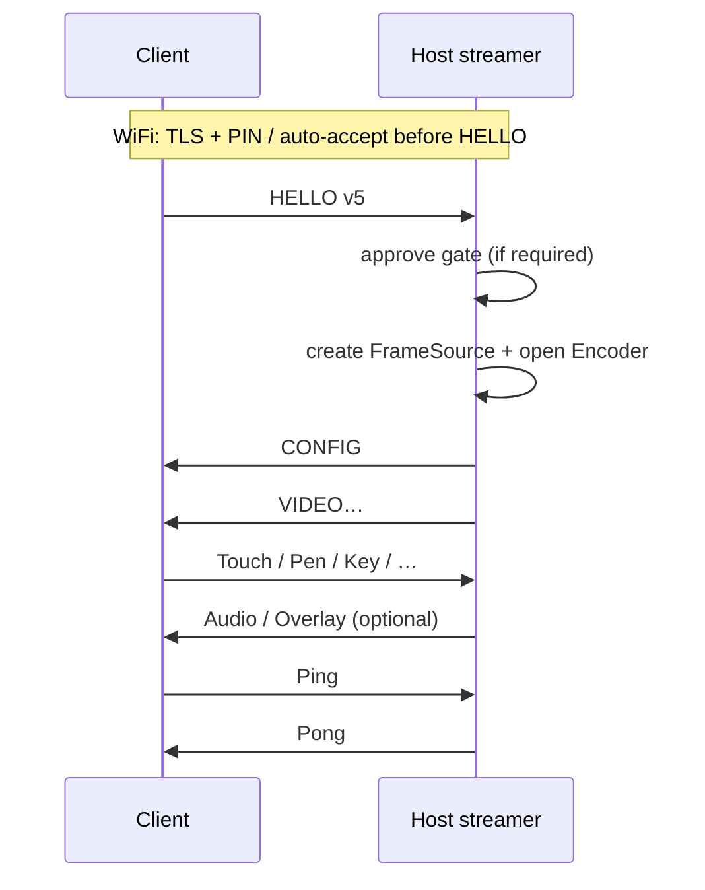

# Architecture: droppix

**Last verified:** 2026-07-18 against local/fork `master`.

Living overview of how droppix turns a client (Android tablet or Linux receive app) into an extended (or mirrored) monitor for a Linux host. Feature ship-state: [`STATUS.md`](STATUS.md). Wire details: [`WIRE.md`](WIRE.md).

## System at a glance

One host control panel (`droppix_gui`) can run **N** streamer processes (`droppix_stream`). Each streamer owns one virtual display (evdi), one H.264 encode path, one transport session, and one set of uinput devices. Clients decode video and send input / orientation / settings back on the same connection.



## Process topology

The GUI never embeds the encode loop. It builds a CLI, launches `droppix_stream` (often under `pkexec` for root uinput/evdi), and parses `--stats-json` / stdin control lines.



| Process | Privilege | Role |
|---|---|---|
| `droppix_gui` | user | Discovery, pairing UI, session manager, audio sink create, spawn streamers |
| `droppix_stream` | often root via `pkexec` | Accept client, create evdi, encode, inject input, stream audio |
| Android / `droppix_client` | device / user | Decode, display, capture input, send HELLO settings |

## Video path

Capture is CPU BGRA from evdi today (no zero-copy GPU capture). Encode prefers GPU when available.



### Encoder cascade



- Factory: `host/src/encoder_factory.*` (`make_encoder`, `--encoder auto|nvenc|vaapi|software`).
- All backends keep **in-band SPS/PPS on every IDR** so clients configure from the first keyframe (`CONFIG.extradata` usually empty).

## Input / control path

Clients normalize; host replays via uinput. Multi-touch, pen, keys, scroll, and mouse buttons are separate message types (see [`WIRE.md`](WIRE.md)).



| Client event | Wire | Host device |
|---|---|---|
| Fingers | `Touch` (+ legacy `Input`) | `droppix-touch` (MT slots) |
| Stylus | `Pen` | pen uinput (`ABS_PRESSURE`, eraser) |
| Keyboard / OSK | `Key` | `droppix-keyboard` |
| Wheel / RMB/MMB | `Scroll` / `MouseButton` | aux pointer |
| Orientation | `Orientation` | may force session rebuild at new dims |
| Settings | HELLO fields | `select_session_params` |

## Multi-monitor sessions



- One `droppix_stream` per tablet; GUI owns lifecycle (`host/gui/session_manager.*`, `port_alloc.*`).
- Source factory runs **after** HELLO so the evdi EDID matches the client’s native size.

## Transports

Same length-prefixed protocol; different `ByteChannel` under `TransportServer`.



| Path | Discovery | Trust |
|---|---|---|
| WiFi | Avahi mDNS | TLS cert pin + 6-digit PIN / approved store |
| `adb reverse` | GUI USB path | localhost |
| USB tether | `TetherProbe` / `tether_discovery` | TLS + device id |
| AOA | `aoa_scan` / known store | accessory link |

## DesktopBackend seam

Compositor-specific work is behind one interface (`host/src/desktop_backend.*`). Display creation itself is evdi; backends handle geometry, touch/pen binding, and mirror/extend layout.

```mermaid
classDiagram
    class DesktopBackend {
        <<interface>>
        +name()
        +outputs()
        +map_touch(output, touch_dev)
        +map_pen(output, pen_dev)
        +adopt_output(output)
        +apply_layout(evdi_output, mode)
    }
    class KWinBackend
    class X11Backend
    class GenericBackend
    DesktopBackend <|-- KWinBackend
    DesktopBackend <|-- X11Backend
    DesktopBackend <|-- GenericBackend
    KWinBackend : kscreen-doctor + KWin InputDevice DBus
    X11Backend : xrandr + xinput map-to-output
    GenericBackend : display may work; touch map no-op
```

Roadmap (not shipped): Sway / GNOME Wayland backends — see [`superpowers/specs/2026-07-05-cross-desktop-portability-design.md`](superpowers/specs/2026-07-05-cross-desktop-portability-design.md).

## Client decode paths



Android render stage is also the hook for client-side image adjustments; host still sends plain H.264.

## Handshake (simplified)



## Repository map

| Path | Responsibility |
|---|---|
| `host/src/` | Streamer core: protocol, evdi, encoders, transport, AOA, tether, input, audio, desktop_backend |
| `host/gui/` | Qt6 GUI: sessions, mDNS, TLS/PIN, auto-connect, settings, AOA/tether scanners |
| `android/` | Kotlin tablet client |
| `client/` | Qt6 Linux receive client (shares `host/src/protocol.cpp`) |
| `packaging/` | AppImage / Flatpak / APK |
| `macos/` | Archived host backend (not in build) |
| `docs/` | STATUS, WIRE, this file, specs/plans, lessons |

## Hard constraints (load-bearing)

1. Streamer needs root for uinput + evdi on the primary path (`pkexec`).
2. Kernel `evdi` module must exist on the host; it cannot ship inside an AppImage.
3. Flatpak reaches the host via `flatpak-spawn --host` (sandbox effectively escaped for integration).
4. C++ / Kotlin / desktop-client protocol codecs must stay byte-identical; bump `kProtocolVersion` on HELLO/wire shape changes and update [`WIRE.md`](WIRE.md) in the same change.

## Related docs

| Doc | Role |
|---|---|
| [`STATUS.md`](STATUS.md) | Shipped vs roadmap |
| [`WIRE.md`](WIRE.md) | Message types + HELLO v5 |
| [`README.md`](README.md) | Docs hub |
| [`../README.md`](../README.md) | Build / requirements |
| [`../scratchpad.md`](../scratchpad.md) | Session memory |
| [`superpowers/specs/2026-06-23-android-extended-display-design.md`](superpowers/specs/2026-06-23-android-extended-display-design.md) | Original design (historical) |
